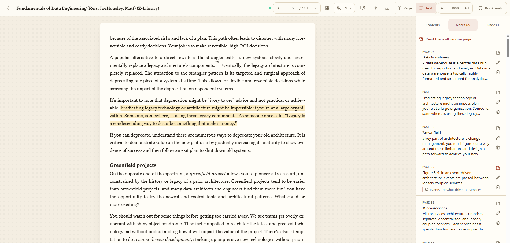
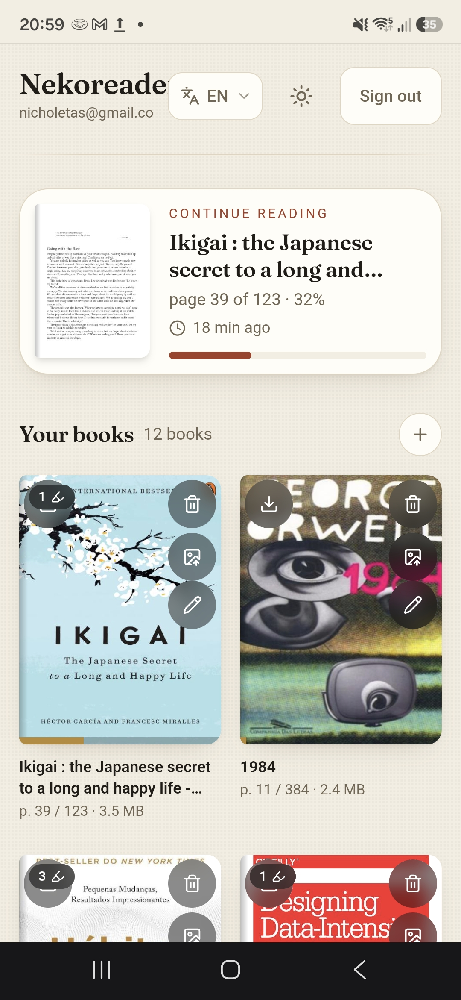
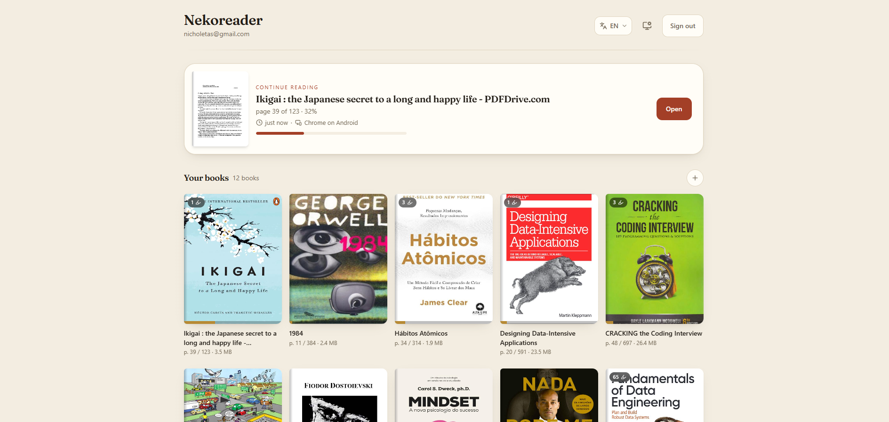

<p align="center">
  <picture>
    <source media="(prefers-color-scheme: dark)" srcset="public/logo-banner-dark.svg">
    
  </picture>
</p>

<p align="center">
  <strong>Leitor de PDF e EPUB no navegador.</strong><br>
  A sua estante, o texto marcado em quatro cores e a página onde você parou —
  no computador e no celular, na numeração que o livro imprime.
</p>

<p align="center">
  <a href="https://nekoreader.com"><strong>nekoreader.com</strong></a> &nbsp;·&nbsp;
  <a href="#funções">Funções</a> &nbsp;·&nbsp;
  <a href="#1-configurar-o-supabase">Instalar</a> &nbsp;·&nbsp;
  <a href="#estrutura">Estrutura</a> &nbsp;·&nbsp;
  <a href="#limites-conhecidos">Limites</a>
</p>

<p align="center">
  
  
  
  
  
  
</p>

<br>

<p align="center">
  
</p>

<p align="center">
  
  &nbsp;&nbsp;&nbsp;
  
</p>

<p align="center">
  <em>Instalável no celular: vai pra tela inicial e abre como app.</em>
</p>

<p align="center">
  <sub>
    Next.js 16 (App Router) · React 19 · Tailwind v4 ·
    Supabase (Auth + Postgres + Storage) · react-pdf / pdf.js · tesseract.js
  </sub>
</p>

---

## Funções

<p align="center">
  
</p>

| Função | Onde |
|---|---|
| Propaganda do app pra quem ainda não tem conta | `/` |
| Criar conta (senha + confirmação) e entrar | `/login` |
| Esqueci a senha → link por e-mail → nova senha | `/forgot` → `/new-password` |
| Estante com upload de PDF/EPUB (arrastar ou tocar) | `/library` |
| Com a estante cheia, o envio some num "+" no canto (modal) | `/library` |
| Capa gerada da página 1 + barra de progresso | `/library` |
| "Continuar lendo" com a página exata | `/library` |
| Leitor com zoom, ← →, deslizar o dedo, ir pra página | `/book/[id]` |
| Marcar texto em 4 cores; tocar na marcação pra apagar | `/book/[id]` |
| Procurar uma palavra no livro inteiro, sem acento e sem caixa | painel |
| Marcar página (★) e lista de páginas guardadas | painel |
| Salva a última página lida sozinho (debounce 700ms) | automático |
| Instalável no celular (PWA, standalone, ícone próprio) | manifest + SW |
| Título e autor: editar à mão, ou descobrir pelo arquivo | estante e leitor |
| Numeração do **livro** (ignora capa/rosto/sumário), inclusive romana | automático |
| Conferir a folha original sem sair do texto remontado | leitor, modo Texto |
| Exportar o livro em EPUB ou Markdown, com a página anotada | leitor |
| OCR de página digitalizada, no próprio aparelho | leitor, modo Texto |
| Equação destacada vira recorte da folha, em vez de texto embaralhado | modo Texto |
| Interface em 6 idiomas, com seletor à mão | toda tela |

### Idiomas

Inglês (padrão e fallback), português do Brasil, espanhol, francês, alemão e
italiano. O idioma sai, nesta ordem, do cookie `neko_lang` (a escolha da
pessoa), do `Accept-Language` do navegador (o palpite) e do padrão.

Quem resolve é o **servidor**, no `layout.tsx`, uma vez por pedido: é isso que
faz o `<html lang>`, o `<title>`, o manifest do PWA e o texto da landing já
nascerem certos, sem o lampejo de inglês que uma troca no cliente daria. O
dicionário do idioma escolhido desce como prop pro `I18nProvider`, então o
navegador baixa **um** idioma, não seis.

```
src/lib/i18n/
  config.ts              locales, cookie, detecção, idiomas do OCR
  servidor.ts            localeAtual() / i18nAtual() — só no servidor
  cliente.tsx            I18nProvider, useT, useI18n, useTrocarIdioma
  formato.ts             fmt("{n} de {total}") e plural() via Intl.PluralRules
  dicionarios/
    en.ts                a referência: as chaves saem daqui
    tipo.ts              alarga os literais do en pra `string`
    pt-BR.ts es.ts fr.ts de.ts it.ts
```

O `en.ts` é a fonte da verdade do **formato**: `Dicionario` é o tipo dele com os
literais alargados, então uma chave nova quebra o `tsc` nos outros cinco
arquivos até ser preenchida. Tradução faltando é erro de compilação, não uma
tela pela metade.

Duas regras que valem a pena lembrar ao mexer:

- **Frase inteira no dicionário, nunca pedaço.** "na página" e "no capítulo" são
  entradas separadas porque a preposição muda com o gênero em português e o caso
  muda em alemão; montar `"n" + artigo + nome` só funciona numa língua.
- **Contagem usa `{ one, other }`** e passa pelo `plural()`, que consulta o
  `Intl.PluralRules` do idioma — o francês trata 0 como singular, o inglês não.

O OCR acompanha: `IDIOMAS_OCR` mapeia cada idioma pro dicionário do tesseract
(`por+eng`, `deu+eng`…), sempre com inglês junto, porque livro técnico em
qualquer língua vem cheio de termo e nome próprio em inglês.

### Como o livro se chama

No envio, o nome sai dos metadados do PDF e, quando eles não prestam, do texto
da capa — onde o título é literalmente o que está escrito maior. O filtro de
lixo é a parte que importa: `Title` costuma vir como "Microsoft Word -
cap1_FINAL2.doc" ou "untitled", e aceitar isso dá um nome errado que ninguém
desconfia que está errado. Sem nada aproveitável, fica o nome do arquivo.

Depois disso é tudo na mão: o lápis no card da estante (ou o título na barra do
leitor) abre título e autor pra editar, com um botão de **descobrir pelo
arquivo** que relê metadados, capa e — se a capa for uma imagem — passa OCR
nela. O que a pessoa escreve sempre ganha do que o app deduz.

### Numeração do livro

Um PDF conta a partir da capa; o livro conta a partir do primeiro capítulo. A
página 121 do arquivo costuma ser a 105 do livro — e é a do livro que aparece na
citação, no índice e na conversa com outra pessoa.

O leitor descobre isso sozinho: usa `/PageLabels` quando o arquivo traz, e senão
lê o número impresso no rodapé de uma amostra de páginas e tira a moda de
"página do arquivo − número impresso". A abertura em romano (i, ii, … xvi) sai
junto. Daí em diante toda a interface fala essa numeração — barra, marcações,
sumário, grade de páginas, a pergunta de "continuar do outro aparelho" — e o
campo "ir para a página" aceita tanto `87` quanto `xix`.

Marcações são salvas como retângulos em **fração da página (0..1)**, então
continuam no lugar certo em qualquer zoom ou tamanho de tela. O véu é
translúcido (`mix-blend-mode: multiply`, alfa ~0.28): o texto continua legível
por baixo.

### Procurar no livro

A quarta aba do painel. Digite uma palavra e ela aparece com o pedaço de frase
em volta, na numeração do livro; tocar leva pra página.

Duas decisões explicam o resto:

- **Procurar é mais tolerante que ler.** Quem digita não repete o livro
  caractere por caractere: escreve sem acento, em minúscula, e a palavra que
  procura pode estar partida entre duas linhas por um hífen. O casamento
  acontece numa forma achatada do texto — sem acento, sem caixa, com aspa curva
  e travessão virando o que dá pra digitar —, mas o trecho mostrado volta **como
  o livro escreveu**. É o que faz "cao" achar "coração" e ainda assim exibir
  "coração".
- **Ler o livro uma vez, procurar muitas.** A primeira busca varre o arquivo
  inteiro (com barra de progresso) e guarda o texto no aparelho; da segunda em
  diante nem o PDF é aberto, e a busca responde a cada tecla. Varredura
  cancelada no meio não é guardada — meio livro guardado faria a busca mentir
  calada.

O texto de cada página sai da mesma remontagem do modo texto, e não do texto
cru: é ela que junta linha em parágrafo e desfaz a hifenização. Página que já
passou por OCR entra de graça, porque o resultado do OCR já estava guardado.

### Mobile

- Barra inferior fixa com alvos de 48px: ‹ · ★ · página · marcações · ›
- Deslizar o dedo na página vira a página (ignorado quando há texto selecionado)
- Painel de marcações vira folha deslizante (bottom sheet)
- `viewport-fit=cover` + `env(safe-area-inset-bottom)` pro notch/gesture bar

### Design

Paleta de papel e tinta (`--paper`, `--ink`, `--accent` vermelho de lombada,
`--gold`), grão sutil no fundo, títulos em **Fraunces** (serifada), claro e
escuro automáticos. Tokens ficam todos no topo de `src/app/globals.css`.

### A marca

Um gato atrás de um livro — o livro que o ícone já era, mais o "neko" que
faltava. A cabeça aparece só uns oito pixels acima da capa, mas é a curva entre
as duas orelhas que faz o olho ler "gato atrás do livro" em vez de "dois
triângulos".

O desenho mora em `src/lib/logo.ts` e é usado em três lugares por caminhos
diferentes, sem existir duas vezes:

| Onde | Como |
|---|---|
| Ícone do PWA e do iOS | `app/icons/[size]` rasteriza com `next/og` |
| Dentro das telas | `components/marca.tsx`, inline no DOM |
| README e `<link rel=icon>` | `public/logo*.svg`, arquivos gerados |

Inline no DOM o SVG usa as variáveis do tema (`--accent`, `--surface`), então a
marca acompanha claro e escuro sozinha, sem duas cópias. Já o ícone e os
arquivos de `public/` são desenhados fora de qualquer página — ali não há CSS
pra resolver variável, e as cores vão por extenso.

O wordmark é contorno, não `<text>`: um SVG com `<text>` usa a fonte da máquina
de quem olha, e o logo mudaria de forma de computador pra computador. As curvas
saem da própria Fraunces que o app carrega.

```bash
node scripts/gerar-logo.mjs    # reescreve public/logo*.svg
python scripts/gerar-logo.py   # só se o wordmark mudar (precisa de fonttools)
```

Nenhum dos dois roda no build. `test/logo.test.mjs` é que garante que os
arquivos commitados continuam batendo com o desenho — arquivo gerado e
versionado envelhece calado.

---

## 1. Configurar o Supabase

1. Crie um projeto em <https://supabase.com> (plano free serve).
2. **SQL Editor → New query** → cole o conteúdo de
   [`supabase/schema.sql`](supabase/schema.sql) → **Run**.
   Isso cria as tabelas `books`, `highlights`, `bookmarks` e
   `reading_positions`, liga RLS (cada usuário só enxerga o que é dele), cria a
   função `contagem_marcacoes()` que a estante usa pra contar as marcações de
   cada livro, e cria o bucket privado `books`.

   O arquivo é idempotente: rodar de novo num banco que já existe só acrescenta
   o que faltava.
3. **Authentication → Providers → Email**: deixe ligado.
   - Pra testar rápido, desligue *Confirm email*.
   - Se deixar ligado, o usuário recebe e-mail e volta por `/auth/callback`.
4. **Authentication → URL Configuration** (obrigatório pro "esqueci a senha"
   funcionar):
   - *Site URL*: `http://localhost:3000` (e depois a URL da Vercel)
   - *Redirect URLs*: adicione `http://localhost:3000/**` e
     `https://SEU-APP.vercel.app/**`
5. **Project Settings → API**: copie `Project URL` e a chave `anon public`.

## 2. Rodar local

```bash
cp .env.example .env.local   # e preencha as duas variáveis
npm install
npm run dev
```

Abra <http://localhost:3000>, crie a conta, suba um PDF.

> `predev`/`prebuild` copiam o worker e os cMaps do pdf.js pra `public/`.
> Esses arquivos são gerados — não precisam ir pro git.

Pra testar o PWA (instalar no celular, service worker) precisa de build de
produção — o SW só registra em produção:

```bash
npm run build && npm start
```

### Testes

```bash
npm test
```

`pretest` compila os módulos puros de `src/lib` pro node (em
`node_modules/.cache/teste`) e `node --test` roda `test/`. São testes da parte
que erra caro e não dá pra conferir de olho: a numeração impressa, a detecção de
fórmula (principalmente o que **não** é fórmula), a conversão pra EPUB/Markdown,
o casamento da busca (achar "ção" digitando "cao", e **não** achar o que não
está lá) e se os SVG de `public/` ainda batem com o desenho de `lib/logo.ts`.

O `tsc` também é teste aqui: `npm run typecheck` é o que cobra as seis traduções
de toda chave nova.

## 3. Deploy na Vercel

```bash
npm i -g vercel     # se ainda não tiver
git init && git add -A && git commit -m "leitor de pdf"
vercel              # segue o wizard
```

Ou: suba pro GitHub e importe o repo em <https://vercel.com/new>.

Em **Project → Settings → Environment Variables** cadastre (Production +
Preview):

```
NEXT_PUBLIC_SUPABASE_URL
NEXT_PUBLIC_SUPABASE_ANON_KEY
```

Depois do primeiro deploy, volte no Supabase e adicione a URL da Vercel em
*Site URL* e *Redirect URLs* (passo 1.4).

---

## Estrutura

```
src/
  proxy.ts                     guarda de rota + refresh de sessão (Next 16)
  lib/
    i18n/                      idiomas (ver "Idiomas" acima)
    supabase/{client,server,session}.ts
    pdf.ts                     worker do pdf.js, nº de páginas e capa
    pdf-blocos.ts              remontagem: linha → parágrafo, título, tabela, fórmula
    pdf-rotulos.ts             numeração impressa do livro (folio, romano, deslocamento)
    pdf-titulo.ts              título e autor: metadados peneirados, capa, OCR
    pdf-ocr.ts                 página digitalizada → os mesmos Item do pdf.js
    busca.ts                   casamento sem acento e sem caixa, e o trecho em volta
    pdf-busca.ts               lê o livro inteiro uma vez, pra a busca ter onde procurar
    use-busca.ts               a aba de busca: varre uma vez, guarda, procura em memória
    exportar.ts                blocos → EPUB 3 (com page-list) e Markdown
    logo.ts                    o desenho da marca — fonte única do gato e do livro
    offline-db.ts              IndexedDB: livro baixado, retratos, fila de sincronização
    offline-sync.ts            executa ou enfileira; esvazia a fila quando volta a rede
    types.ts                   Book, Highlight, Bookmark, Rect, cores
  app/
    globals.css                paleta, grão, estilo das marcações
    layout.tsx                 resolve o idioma e monta o I18nProvider
    manifest.ts                manifest do PWA, no idioma do pedido
    icons/[size]/route.tsx     ícones 180/192/512 gerados (next/og) a partir de lib/logo.ts
    error.tsx                  erro em qualquer tela, no idioma da pessoa
    global-error.tsx           o erro que derruba o próprio layout (último recurso)
    not-found.tsx              rota que não existe
    page.tsx                   landing (pública; logado é mandado pra /library)
    login/                     entrar / criar conta (senha + confirmação)
    forgot/                    pedir link de recuperação
    new-password/              trocar a senha depois do link
    auth/callback              confirma e-mail e troca `code` por sessão
    auth/signout               sair
    library/page.tsx           estante
    book/[id]/page.tsx         livro + URL assinada + marcações
    book/[id]/notes/page.tsx   marcações em página inteira
  components/
    ui.tsx                     Campo, Botao, Aviso (alvos de 48px)
    marca.tsx                  a marca inline, que acompanha o tema pelas variáveis
    auth-shell.tsx             moldura das telas de conta
    seletor-idioma.tsx         troca de idioma (<select> nativo)
    prints-app.tsx             as duas telas do app (computador + celular), na landing
    uploader.tsx               upload com capa gerada no cliente
    book-card.tsx              capa com lombada + progresso
    reader.tsx                 barras, painel, folhas, persistência
    pdf-canvas.tsx             render, seleção → marcação, swipe
    sw-register.tsx            registra o service worker (só em produção)
public/sw.js                   cache de asset estático (nunca HTML/sessão)
public/logo*.svg               marca e banner — gerados por scripts/gerar-logo.mjs
supabase/schema.sql            tabelas, RLS, bucket, contagem de marcações
```

## Segurança

- Bucket `books` é **privado**; o app usa URLs assinadas (6h pro PDF, 1h pras
  capas).
- RLS em todas as tabelas: `auth.uid() = user_id`. Policies de Storage exigem
  que o arquivo esteja na pasta `<user_id>/`.
- Só a chave `anon` vai pro navegador — nunca use a `service_role` no front.

## Limites conhecidos

- Leitura é **uma página por vez** (não é scroll contínuo).
- No modo Página, marcar depende da camada de texto do PDF. Página digitalizada
  precisa do OCR (modo Texto), que é sob demanda, uma página por vez.
- O OCR baixa o dicionário do idioma de um CDN na primeira vez (fica no
  IndexedDB depois). O worker e o núcleo WASM são servidos pelo próprio app.
- A numeração do livro sai da camada de texto: livro digitalizado só ganha ela
  depois do OCR, página a página. A busca segue a mesma regra — acha o que tem
  camada de texto, e a página digitalizada só entra depois de passar o OCR.
- A busca leva a pessoa até a página; ela não pinta a ocorrência em cima da
  folha desenhada.
- Limite de 100 MB por arquivo (ajustável em `supabase/schema.sql`).
